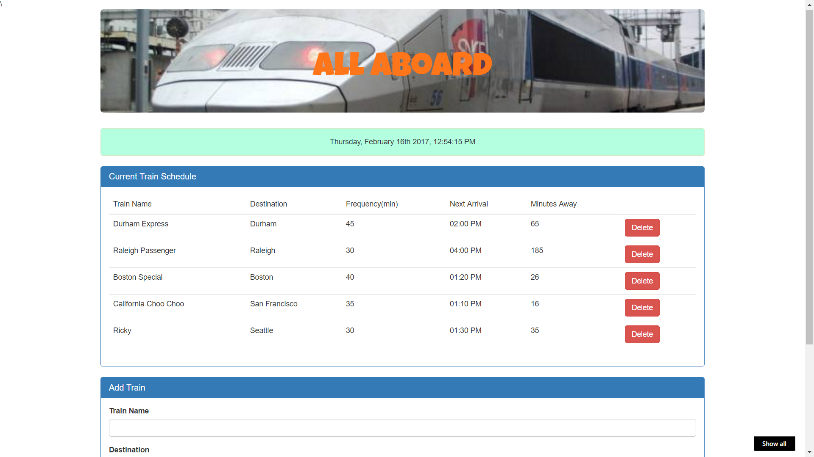

# TrainSchedulerapp
A train schedule application that incorporates Firebase to host arrival and departure data. The application retrieves and manipulate this information with Moment.js. It provides up-to-date information about various trains, namely their arrival times and how many minutes remain until they arrive at their station.
The "minutes to arrival" and "next train time" are updated once every minute

## Screenshots

## Technologies used
- jQuery
- Firebase
- Moment.js
- Bootstrap
- HTML
- CSS

## Built With

* Sublime Text

## Authors

* **Jincy George** - *Initial work* - [Jincy George](https://github.com)
